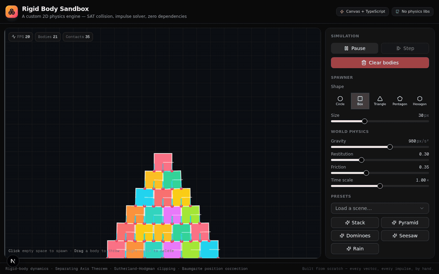

# Rigid Body Sandbox — A Custom 2D Physics Engine

A from-scratch 2D rigid-body physics engine and interactive sandbox, built with
**HTML5 Canvas + TypeScript** — **zero physics libraries**.

No Matter.js, no Box2D, no p2. Every vector operation, every collision test, every
impulse is implemented by hand. The hard part — gluing the Separating Axis Theorem
into a stable game loop so stacks don't jitter or fall through the floor — is the
whole point of this project.



[](https://realphysics.com/)


---

## Features

### Physics core (`src/lib/physics/`)
- **`vector.ts`** — full 2D vector algebra: dot, both cross-product forms
  (scalar and scalar×vector), rotate, perpendicular, in-place mutators for the
  hot solver loops.
- **`shapes.ts`** — circles + convex polygons. Polygons are built CCW,
  re-centered on their centroid, with precomputed outward edge normals. Includes
  builders for boxes and regular n-gons, plus shoelace area / centroid / mass
  moment of inertia.
- **`body.ts`** — rigid bodies with linear + angular state, mass/inertia
  properties, material settings, cached world-space vertices/normals/AABBs, and
  kinematic/static flags for the mouse grab.
- **`manifold.ts`** — collision detection for all shape pairs:
  - Circle ↔ Circle (direct distance test)
  - Circle ↔ Polygon (Voronoi face/vertex region test)
  - **Polygon ↔ Polygon — full SAT + Sutherland-Hodgman contact clipping**,
    producing up to 2 contact points per manifold.
- **`world.ts`** — fixed-timestep simulation pipeline:
  1. integrate forces (gravity + accumulated forces → velocity)
  2. sync transforms (recompute world verts/normals/AABBs)
  3. broad phase (AABB overlap pairs, O(n²))
  4. narrow phase (build manifolds)
  5. **sequential impulse solver** — N iterations of normal impulse
     (restitution) + tangential impulse (Coulomb friction cone)
  6. integrate velocity → position
  7. **Baumgarte position correction** to kill sinking
  8. NaN guard for solver blow-ups

### Interactive sandbox (`src/components/`)
- DPR-aware canvas renderer with a stable accumulator game loop
- **Mouse grab & throw** — bodies go kinematic while held (yellow outline),
  inherit the cursor's velocity on release
- Click empty space to **spawn**, right-click to **delete**
- Live sliders: gravity, restitution, friction, time-scale, spawn size
- 5 presets: **Stack, Pyramid, Dominoes, Seesaw, Rain**
- **Debug overlays** (the things you stare at when it glitches):
  - AABB (broad-phase bounds)
  - Velocity vectors
  - Contact points (red dots)
  - Contact normals (cyan lines)
  - Broadphase pairs (purple lines)
  - Grid
- Keyboard shortcuts: `Space` pause, `1`–`5` pick shape, `R`/`C` clear
- Throttled HUD: FPS, body count, contact count, pair count

---

## Getting started

```bash
# install
bun install

# run the dev server (http://localhost:3000)
bun run dev

# lint
bun run lint
```

Open the app, try the **Pyramid** preset, then grab a box out of the middle and
fling it — the stack stays stable. Or crank **Restitution** to `1.0` and drop
circles to watch them bounce.

---

## How it works (the interesting bits)

### SAT + contact clipping

For two convex polygons, the Separating Axis Theorem says they're disjoint iff
some axis (one of the edge normals) separates them. When they overlap, the
least-penetrating axis becomes the **collision normal**, and the contact points
are found by **clipping the incident polygon's edge against the reference
polygon's face planes** (Sutherland-Hodgman). This is what gives you the two
contact points you need for stable stacking — a single point makes stacks wobble
and collapse.

### Impulse-based resolution

For each contact, the solver computes a normal impulse that cancels the
approaching relative velocity (scaled by restitution), plus a tangential impulse
clamped to the friction cone `|jt| ≤ μ · j`. Multiple solver iterations per step
converge to a consistent solution for stacks.

### Baumgarte position correction

Floating-point drift + discrete timesteps let bodies sink into each other by a
few pixels per frame. A small position correction (40% of penetration above a
0.05px slop) is applied along the contact normal each step to push them back out
without adding energy.

### The bug that almost shipped

The first pass had a transcription error in the clipping constants: the side-plane
clip used `-Dot(normal, v2)` instead of `-Dot(normal, v1)`, and the final depth
test used the side constant instead of the face-normal constant. The symptom was
sneaky — boxes **fell through the floor silently** while the body counter still
reported them present. Only end-to-end browser verification (a screenshot showed
an "empty" canvas that was actually just the spawn ghost) caught it.

---

## Tech stack

- **Next.js 16** (App Router) + **TypeScript 5**
- **Tailwind CSS 4** + **shadcn/ui** for the control panel
- **HTML5 Canvas 2D** for rendering
- No physics libraries. No game framework. Just math.

---

## Contributing

PRs that improve solver stability, add shapes, or fix subtle glitches are very
welcome. See **[CONTRIBUTING.md](./CONTRIBUTING.md)** for the architecture
walkthrough, how to add presets/shapes, solver tuning knobs, and the debug
overlays to use when something falls through the floor.

## License

MIT — see [LICENSE](./LICENSE).
